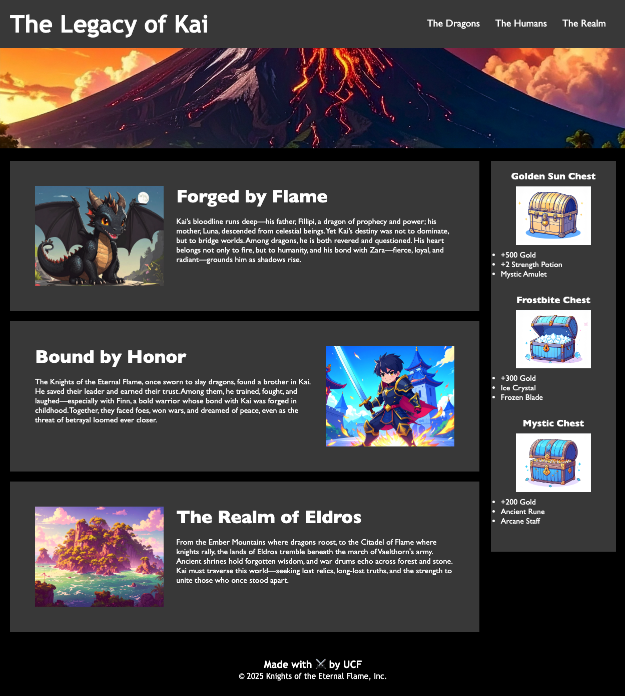

# The Legacy of Kai: Accessibility and Code Refactor Challenge

## Overview

This challenge focuses on improving the accessibility and maintainability of an existing website, **The Legacy of Kai**, while preserving its functionality and design. The goal is to refactor the codebase to follow semantic HTML standards, optimize CSS for efficiency, and ensure the site is accessible to all users, including those using assistive technologies.

## Goal

```md
AS A user exploring the story of Kai
I WANT a website that is accessible and visually appealing
SO THAT I can easily navigate and enjoy the content
```

## Problem

```md
GIVEN a webpage meets accessibility standards
WHEN I view the source code
THEN I find semantic HTML elements
WHEN I view the structure of the HTML elements
THEN I find that the elements follow a logical structure independent of styling and positioning
WHEN I view the image elements
THEN I find accessible alt attributes
WHEN I view the heading attributes
THEN they fall in sequential order
WHEN I view the title element
THEN I find a concise, descriptive title
```

## Features of the Refactored Website

### Semantic HTML

- The website uses semantic elements such as `<header>`, `<nav>`, `<main>`, `<section>`, `<aside>`, and `<footer>` to structure the content logically.
- Images include descriptive `alt` attributes for accessibility.

### CSS Optimization

- CSS selectors and properties are consolidated for efficiency.
- Styles are organized to follow the semantic structure of the HTML.
- Comments are added to improve readability and maintainability.

### Accessibility Enhancements

- The site ensures compatibility with assistive technologies.
- Logical heading structure and descriptive titles improve navigation and usability.

## Website Content

### Sections

1. **The Dragons**: Explore Kai’s lineage and his role as a bridge between dragons and humans.
2. **The Humans**: Learn about Kai’s bond with the Knights of the Eternal Flame and his friendship with Finn.
3. **The Realm**: Discover the lands of Eldros, from the Ember Mountains to the Citadel of Flame.

### Interactive Features

- Navigation menu for quick access to sections.
- Hero image showcasing the world of Kai.
- Treasure chests with detailed descriptions of their contents.

### Visual Design

- Dark theme with contrasting colors for readability.
- Hero image and section images enhance the storytelling experience.

## Mock-Up

The following image demonstrates the updated design and functionality of the website:



## Getting Started

To get started, clone the repository and open the `index.html` file in your browser. Use the provided `style.css` file to apply the styles.

### File Structure

```
/assets
  /css
    - style.css
  /images
    - kai.jpg
    - finn.jpg
    - forgottenIsle.jpg
    - goldenSunChest.jpg
    - frostbiteChest.jpg
    - mysticChest.jpg
    - ashenWastes.jpg
- index.html
```

## Grading Requirements

This challenge will be graded based on the following criteria:

### Semantic HTML (40%)

- Proper use of semantic elements (`header`, `nav`, `main`, `section`, `aside`, `footer`).
- Logical structure of HTML elements.

### Accessibility (30%)

- All images include descriptive `alt` attributes.
- Headings follow a sequential order.
- Title is concise and descriptive.

### CSS Optimization (30%)

- Efficient and organized CSS.
- Styles match the semantic structure of the HTML.
- Comments are included for clarity.

## Review

You are required to submit BOTH of the following for review:

- The URL of the functional, deployed application.

- The URL of the GitHub repository, with a unique name and a README that describes the project.

---

**Note**: Always strive to leave the codebase cleaner and more maintainable than you found it. Follow the **Scout Rule** to impress clients and improve long-term sustainability.
