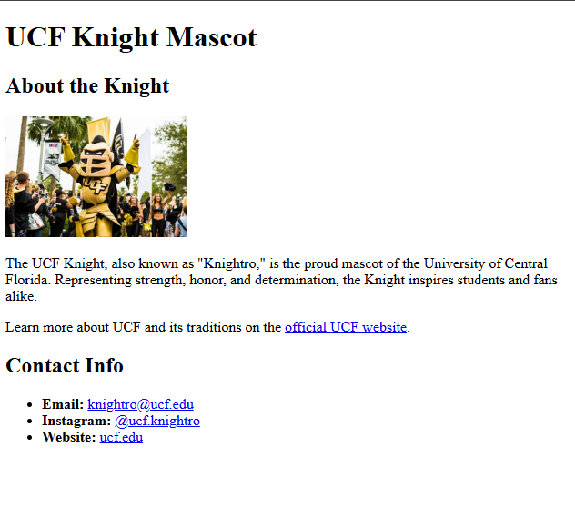

# 🏗️ Create a Webpage About the UCF Knight Mascot

Work with a partner to implement the following user story:

* As a fan of UCF, I want to create a webpage that highlights the UCF Knight mascot, including an image, a description, and contact information.

## Acceptance Criteria

* It's done when the main header reads "UCF Knight Mascot".

* It's done when there is a section that includes the mascot's name, an image, and a paragraph describing the mascot.

* It's done when there is a second section that includes a subheader labeled "Contact Info" and a list that includes links to the mascot's email, Instagram, and the official UCF website.

* It's done when the finished page matches the mockup.

## Assets

The following image demonstrates the web application's appearance and functionality:

You can use this [image](https://www.ucf.edu/wp-content/blogs.dir/20/files/2017/02/UCF-Knightro-2017.jpg). Remember to size it with a width attribute.

---

## 💡 Hints

How can you use header elements to define the most important heading and the subheaders? How will using different header elements impact the size of the text?

Refer to the [HTML Docs](https://developer.mozilla.org/en-US/docs/Web/HTML)

## 🏆 Bonus

If you have completed this activity, work through the following challenge with your partner to further your knowledge:

* What are the advantages of using semantic elements in your HTML? 

Use [Google](https://www.google.com) or another search engine to research this.

