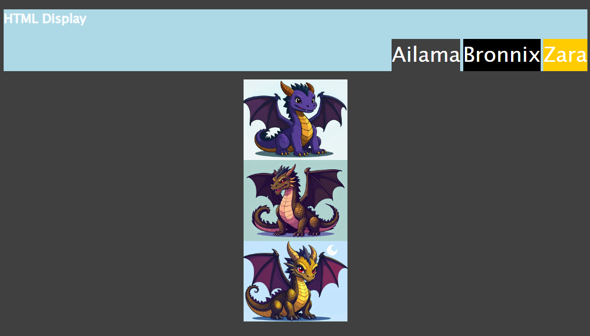

# 🐛 Names and Dragons Are Not Displaying Correctly

Work with others to resolve the following issues:

* Users should be able to see a horizontal navigation bar with three Names side-by-side.

* Users should be able to see three Dragons.

* Users should be able to see the Dragons centered and stacked on top of each other.

## Expected Behavior

* All three list items in the navigation bar should display inline.

* All three Dragons should be visible. 

* Each Dragon should appear centered and on its own line.

## Actual Behavior

* Each Name in the navigation bar displays on its own line.

* Two Dragons are visible, and one is not displayed.

* The two visible Dragons display inline and aligned to the left. 

## Assets

The following image demonstrates the web application's appearance and functionality:

---

## 💡 Hints

Which `display` value hides an element? 

## 🏆 Bonus

If you have completed this activity, work through the following challenge with your partner to further your knowledge:

* What is the CSS `visibility` property? How is it different from the `display` property?

Use [Google](https://www.google.com) or another search engine to research this.

